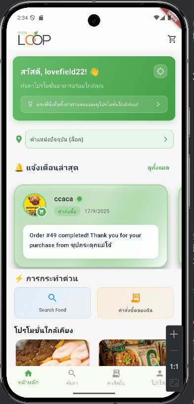
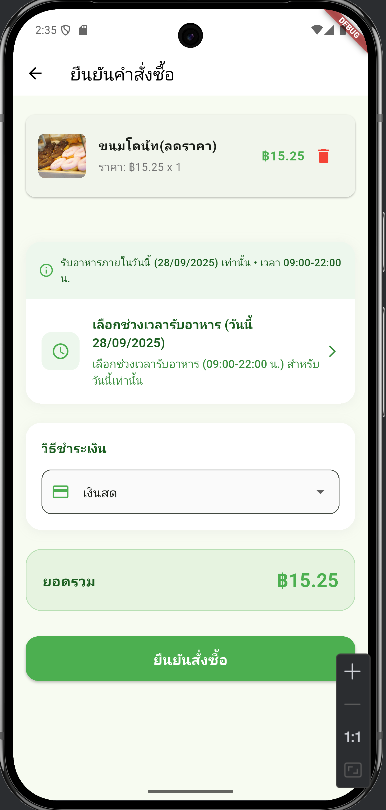
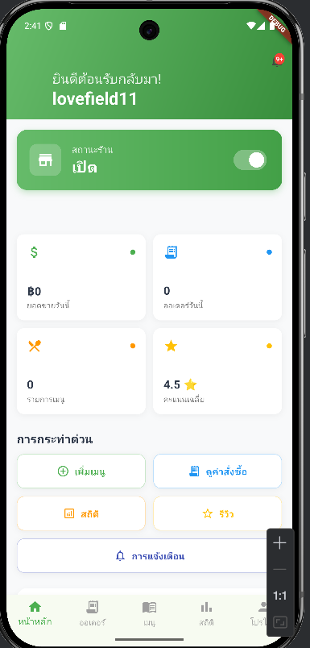
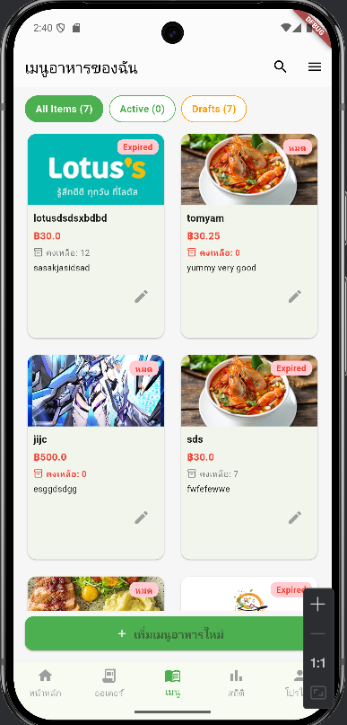
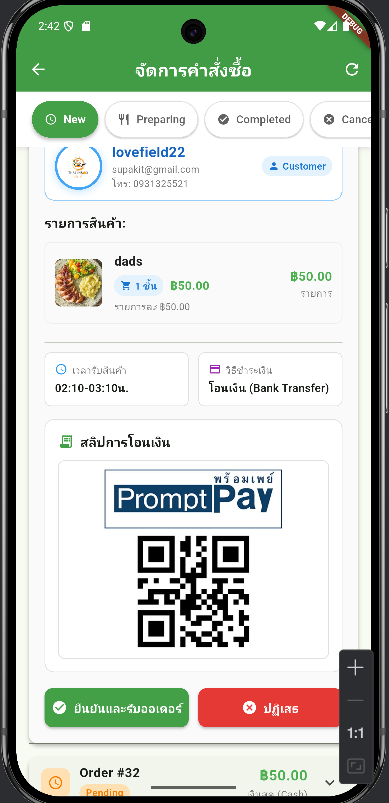
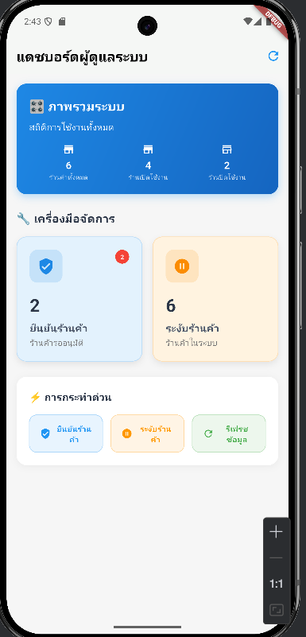

# 🔥 FoodLoop — Flutter Food Delivery App

> **แอปลดปัญหาขยะอาหารครบวงจร** สำหรับผู้บริโภค (Consumer), ผู้ขาย (Seller) และผู้ดูแลระบบ (Admin)

---

> **FoodLoop** : แอปพลิเคชันที่ช่วยลดการสูญเสียอาหาร โดยเชื่อมต่อผู้ขายและลูกค้าผ่านระบบจัดการออเดอร์แบบเรียลไทม์ พร้อมระบบ GPS สำหรับค้นหาร้านใกล้เคียง และการจัดการครบวงจรสำหรับทุกบทบาทผู้ใช้

---

## ✨ ภาพรวม (Overview)

* **Project**: FoodLoop (Food Waste Reduction App)
* **Platform**: Flutter (Dart) + Spring Boot Backend
* **Database**: MySQL 
* **Architecture**: REST API + Real-time Location Services
* **Language Support**: ภาษาไทย (Thai UI)

---

## 🖼️ Screenshots (Preview)

> รูปทั้งหมดวางไว้ในโฟลเดอร์โปรเจค: `admin_dash.png`, `consumer_map.png`, `seller_dashboard.png`, `order_tracking.png`, `food_management.png`

<div align="center">

  

<br/>
  
  
  3
   
</div>

---

## 🎯 ฟีเจอร์หลัก (Key Features)

### **📱 Consumer (ผู้บริโภค)**
- 🗺️ **ค้นหาร้านด้วย GPS** - แสดงร้านใกล้เคียงบนแผนที่พร้อมรัศมีปรับได้
- 🍽️ **เรียกดูเมนูและสั่งอาหาร** - ระบบตะกร้าสินค้าแบบเรียลไทม์
- 📍 **ติดตามสถานะออเดอร์** - อัปเดตสถานะตั้งแต่รับออเดอร์จนถึงพร้อมรับ
- 💳 **ระบบชำระเงิน** - รองรับ PromptPay และการชำระเงินสด
- ⭐ **รีวิวและให้คะแนน** - ประเมินร้านค้าและอาหาร

### **🏪 Seller (ผู้ขาย)**
- 📊 **Dashboard แบบเรียลไทม์** - ยอดขาย, จำนวนออเดอร์, คะแนนเฉลี่ย
- 🍕 **จัดการเมนูอาหาร** - เพิ่ม/แก้ไข/ลบเมนู พร้อมอัปโหลดรูปภาพ
- 📋 **จัดการออเดอร์** - รับ/ปฏิเสธ/ยกเลิกออเดอร์ในทุกสถานะ
- 🔄 **เปิด/ปิดร้าน** - ระบบ toggle สถานะร้านแบบเรียลไทม์
- 📈 **สถิติการขาย** - วิเคราะห์ยอดขาย, กำไร, สินค้าขายดี
- 🔔 **ระบบแจ้งเตือน** - แจ้งเตือนออเดอร์ใหม่และกิจกรรมสำคัญ

### **👨‍💼 Admin (ผู้ดูแลระบบ)**
- 🏛️ **Dashboard ภาพรวมระบบ** - สถิติทั้งระบบและกิจกรรมผู้ใช้
- ✅ **อนุมัติผู้ขาย** - ตรวจสอบและอนุมัติการสมัครร้านค้าใหม่
- 👥 **จัดการผู้ใช้** - ดูข้อมูลและจัดการบัญชี Consumer และ Seller
- 📊 **รายงานและสถิติ** - วิเคราะห์การใช้งานและประสิทธิภาพระบบ

---

## 🛠️ Technical Highlights

### **Frontend (Flutter)**
- **State Management**: Provider pattern + setState
- **Maps Integration**: Google Maps API พร้อม custom markers
- **Real-time Location**: Geolocator + GPS positioning
- **Image Upload**: Camera/Gallery integration
- **HTTP Client**: API calls ด้วย http package
- **Local Storage**: SharedPreferences สำหรับ user sessions

### **Backend (Spring Boot)**
- **RESTful API**: Complete CRUD operations
- **Database**: MySQL with JPA/Hibernate
- **File Storage**: Image upload และ management
- **Geolocation**: Haversine distance calculation
- **Order Management**: Real-time status updates

### **Key Features Implementation**
- 🌍 **GPS-based Store Discovery** - ค้นหาร้านตามตำแหน่งจริง
- 🔄 **Real-time Order Tracking** - อัปเดตสถานะแบบ live
- 📱 **Multi-role Authentication** - ระบบ login แยกตามบทบาท
- 🌐 **Thai Language Support** - UI ภาษาไทยครบถ้วน
- 📍 **Dynamic Location Services** - รองรับการเปลี่ยนตำแหน่ง

---

## 🧩 Tech Stack

**Frontend:**
- Flutter 3.x (Dart)
- Google Maps Flutter Plugin
- Geolocator, HTTP, Image Picker
- Provider, SharedPreferences

**Backend:**
- Spring Boot (Java)
- Spring Data JPA
- MySQL Database
- RESTful API Architecture

**Development Tools:**
- Android Studio / VS Code
- Git Version Control
- ADB for emulator location testing

---

## 📱 Installation & Setup

```bash
# Clone repository
git clone https://github.com/lovefield22/foodloop_project.git
cd foodloop_project

# Install dependencies
flutter pub get

# Run the app
flutter run

# For location testing (Android Emulator)
adb emu geo fix [longitude] [latitude]


